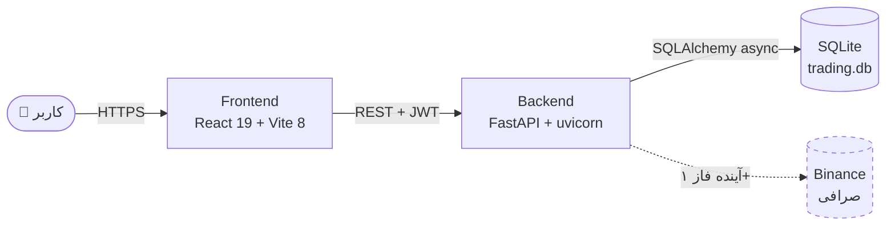
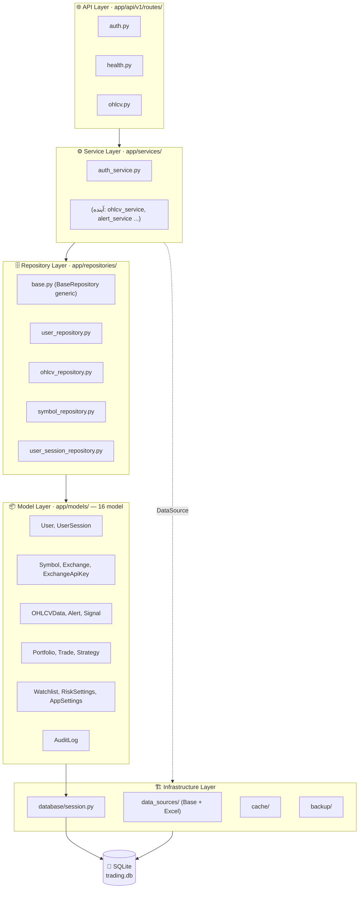
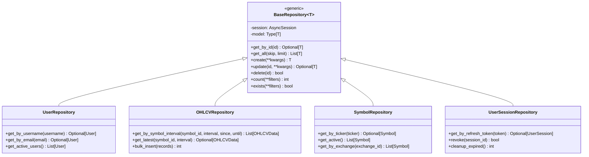
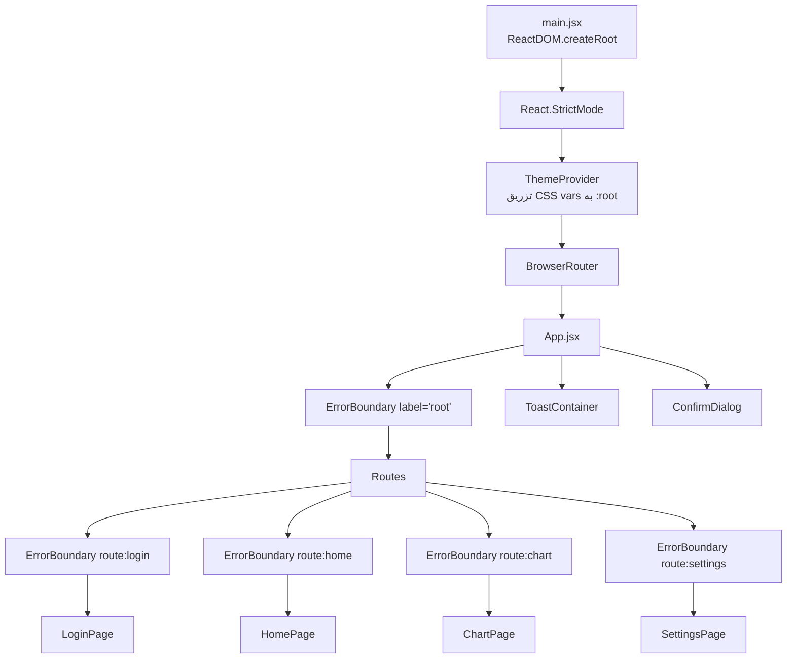
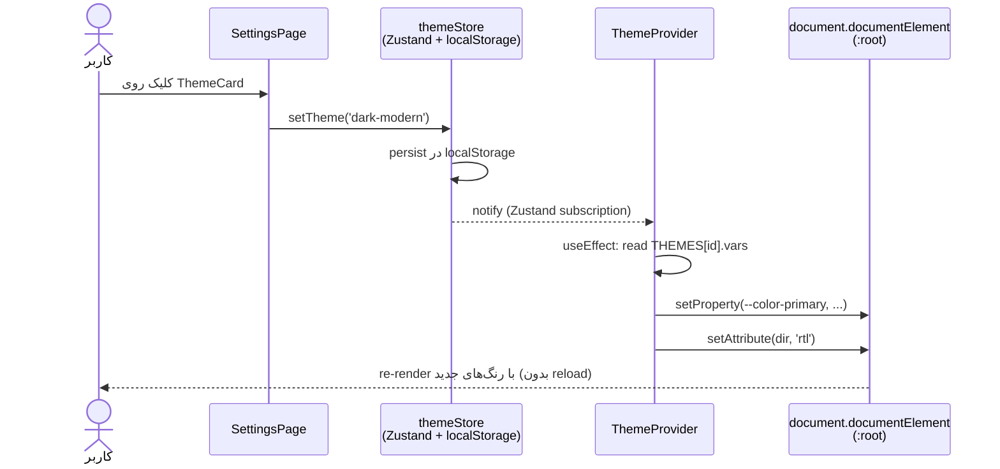
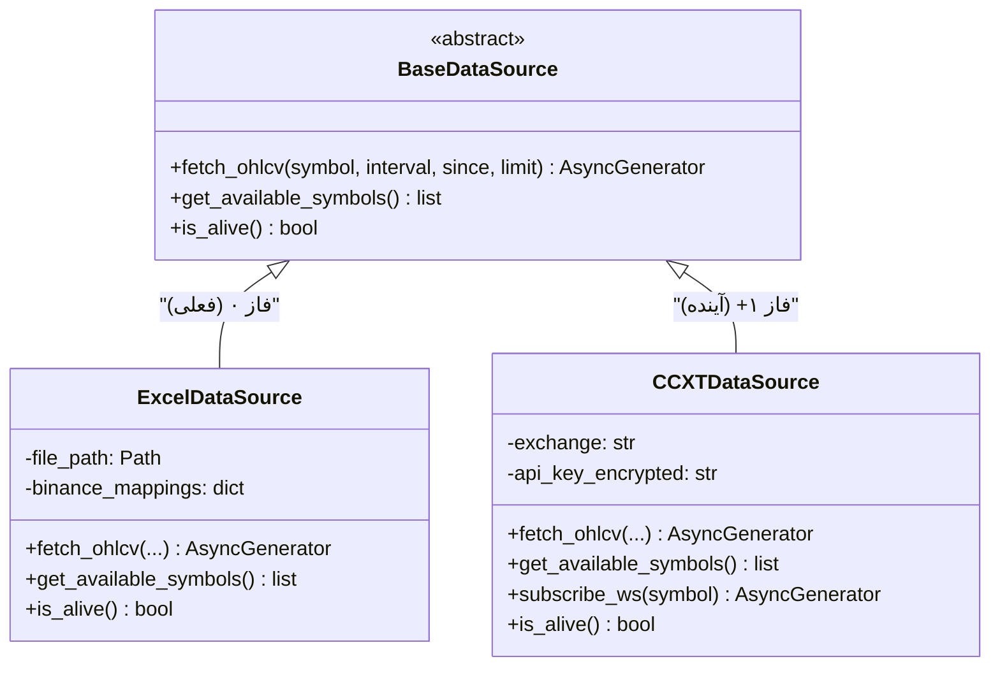
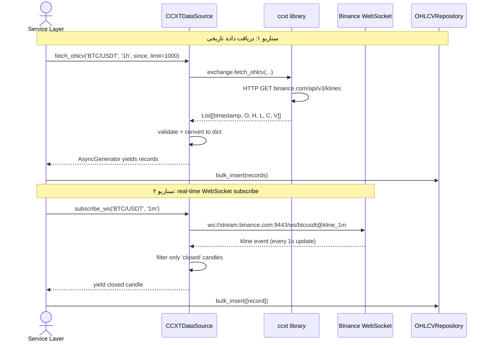
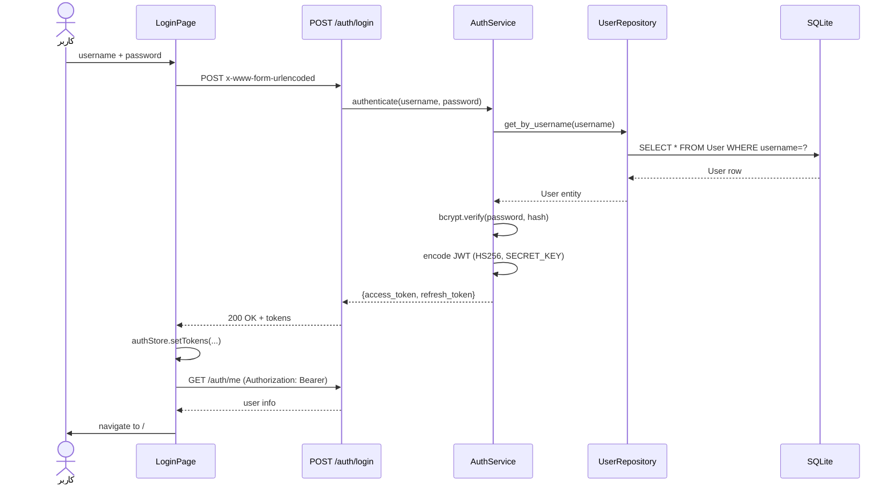

# 🏛️ ARCHITECTURE — معماری سامانه

> **هدف یک‌خطی:** نمای فنی high-level از معماری backend + frontend با دیاگرام‌های Mermaid برای کمک به onboarding و طراحی فازهای بعدی.

> **محل قرارگیری:** `docs/ARCHITECTURE.md`  
> **نسخه پروژه در زمان نگارش:** v0.4.0  
> **آخرین به‌روزرسانی:** 2026-05-19 (چت ۸ — T2.10: Repository Layer + CCXT expansion)  
> **منبع رسمی:** این فایل تصویر معماری را خلاصه می‌کند؛ برای جزئیات کامل (API specs، DB schemas، business rules) به «سند جامع v2.10» مراجعه کنید.

---

## ۱. نمای کلی سیستم

این پروژه یک اپلیکیشن single-page (SPA) با backend جداگانه است:



**جریان داده در فاز ۰:**
- کاربر از طریق مرورگر با Frontend (`http://localhost:5173`) ارتباط دارد.
- Frontend با Backend (`http://localhost:8000/api/v1`) از طریق REST (با JWT برای auth) ارتباط دارد.
- داده‌های OHLCV فعلاً از فایل‌های Excel نمونه (`infrastructure/data_sources/excel_source.py`) خوانده می‌شوند.
- در فاز ۱، DataSource به ccxt + Binance WebSocket متصل می‌شود — **بدون تغییر در API frontend** (abstraction در backend).

---

## ۲. معماری Backend — لایه‌ای

ساختار 5-لایه طبق سند ۵.۲ سند جامع. اصل: هر لایه فقط با لایه‌ی **مستقیماً زیر خود** ارتباط دارد.



**نکات مهم:**
- `app/core/` (پایه‌ای): `config.py`, `security.py`, `exceptions.py`, `handlers.py`, `logging.py`, `response.py` — توسط همه‌ی لایه‌ها قابل استفاده.
- `app/api/v1/dependencies.py` — DI factory functions (`get_db`, `get_current_user`) که توسط FastAPI تزریق می‌شوند.
- `app/schemas/` — Pydantic DTOs برای request/response (نه entity).
- **Repository Layer** از `BaseRepository[T]` generic ارث می‌برد — جزئیات در بخش ۵.۵ پایین.

---

## ۲.۵. جزئیات Repository Layer 🆕 v2.10

Repository Layer abstraction بین Service و Database است — hide کردن SQLAlchemy details از service code (سند ۵.۳ و قانون #۳۵).



**اصول در Repository:**
- هر repository پارامتر اول constructor `session: AsyncSession` دارد.
- متدهای Generic (`get_by_id`, `create`, ...) از `BaseRepository` به ارث می‌رسند.
- متدهای خاص entity (مثل `get_by_username`) در subclass تعریف می‌شوند.
- repository **هیچ‌وقت** business logic ندارد — فقط CRUD + queries.
- Service Layer برای multi-entity transactions از چند repository استفاده می‌کند.

**مثال جریان در service:**
```python
# app/services/auth_service.py
class AuthService:
    def __init__(self, session: AsyncSession):
        self.user_repo = UserRepository(session)
        self.session_repo = UserSessionRepository(session)

    async def login(self, username, password):
        user = await self.user_repo.get_by_username(username)
        if not user or not verify_password(password, user.password_hash):
            raise AuthenticationError()
        session = await self.session_repo.create(user_id=user.id, ...)
        return generate_tokens(user, session)
```

---

## ۳. معماری Frontend — سلسله‌مراتب کامپوننت



**استراتژی defense-in-depth برای ErrorBoundary:**
- مرز **سراسری** (`label='root'`) — کل Routes را در بر می‌گیرد. آخرین خط دفاع.
- مرز **per-route** — هر صفحه‌ی خود را protect می‌کند؛ کاربر می‌تواند با navigate به مسیر دیگر از خطا فرار کند.

---

## ۴. جریان تم (Theme System)

تم‌ها در `frontend/src/themes/themes.js` تعریف شده‌اند (۵ تم). هر تم یک object از CSS variables است:



**قوانین قفل‌شده مرتبط:**
- قانون #۳: هیچ hex hardcoded در کد — همه از `var(--color-*)`.
- قانون #۲۰: همه فایل‌های `.jsx` که styling دارند باید از CSS variables استفاده کنند.

---

## ۵. انتزاع DataSource

طبق سند ۸.۴، backend نباید مستقیماً به Binance یا فایل Excel وابسته باشد. به‌جای آن:



**فایده:** برای تست/development می‌توان از Excel استفاده کرد؛ در production به Binance switch می‌شود — بدون تغییر در service layer. هیچ کد بالاتری (Service یا API) نام کلاس concrete را نمی‌داند؛ فقط `BaseDataSource` را می‌بیند.

### ۵.۱. بسط CCXTDataSource — آماده‌سازی فاز ۱ 🆕 v2.10

CCXT کتابخانه unified برای اتصال به ده‌ها صرافی رمزارز است (Binance، Coinbase، Kraken، ...). در فاز ۱، فقط Binance پشتیبانی می‌شود.



**نکات مهم برای فاز ۱:**
- **API key:** در `ExchangeApiKey` model encrypted ذخیره می‌شود (سند بخش ۶.۳). رمزگشایی فقط در `CCXTDataSource.__init__` در RAM.
- **Rate limiting:** ccxt داخلی rate limit دارد (`exchange.enableRateLimit = True`).
- **Error handling:** `ccxt.NetworkError`, `ccxt.ExchangeError`, `ccxt.RateLimitExceeded` — در service layer catch می‌شوند.
- **WebSocket reconnect:** در صورت disconnect، استراتژی exponential backoff (max 30s).
- **Idempotency:** `OHLCVRepository.bulk_insert` از `INSERT OR REPLACE` (سند ۵.۴.۳) — چکرخ بدون تکرار.

**تست strategy برای CCXTDataSource:**
- Unit tests: mock `ccxt.Exchange` با `unittest.mock.AsyncMock`.
- Integration tests: ccxt sandbox/testnet (`exchange.set_sandbox_mode(True)`).
- E2E tests: فقط در staging با read-only API key.

---

## ۶. جریان Authentication



**نکات امنیتی:**
- JWT در فاز ۰ در `localStorage` ذخیره می‌شود (سند ۶.۴ — قابل قبول برای dev/فاز ۰).
- در فاز ۸+ به httpOnly cookie منتقل خواهد شد (XSS mitigation).
- پسوردها با bcrypt (cost=12) hash می‌شوند — قانون #۶.

---

## ۷. مدیریت State (Zustand)

پنج store در `frontend/src/stores/`:

| Store | فایل | مسئولیت | Persist؟ |
|---|---|---|---|
| `authStore` | `authStore.js` | JWT tokens + user info | ❌ (هر بار login) |
| `themeStore` | `themeStore.js` | id تم فعال | ✅ localStorage |
| `preferencesStore` | `preferencesStore.js` | calendar/language/fontSize/gregorianFormat | ✅ localStorage |
| `toastStore` | `toastStore.js` | لیست toastهای فعال + success/error/warning/info | ❌ |
| `confirmStore` | `confirmStore.js` | dialog سراسری تأیید با Promise resolver | ❌ |

**انتخاب Zustand به‌جای Redux:**
- API ساده‌تر — بدون reducer/action/dispatch boilerplate.
- Bundle size کوچک‌تر (~1KB در مقابل ~10KB).
- `persist` middleware برای localStorage built-in.

---

## ۸. ساختار فایل‌ها

```
trading-system/
├── backend/
│   ├── app/
│   │   ├── api/v1/
│   │   │   ├── routes/        # auth.py · health.py · ohlcv.py
│   │   │   ├── websocket/
│   │   │   └── dependencies.py
│   │   ├── core/              # config · security · exceptions · handlers · logging · response
│   │   ├── domain/            # entities/ · events/ · services/ · value_objects/
│   │   ├── infrastructure/    # backup/ · cache/ · data_sources/ · database/ · exchange/
│   │   ├── models/            # ۱۶ SQLAlchemy model
│   │   ├── repositories/      # ۵ repository (base + ۴ entity)
│   │   ├── schemas/           # Pydantic DTOs
│   │   └── services/          # auth_service.py (+ آینده‌ها)
│   ├── main.py
│   ├── .env / .env.example
│   └── requirements.txt
│
├── frontend/
│   ├── src/
│   │   ├── components/
│   │   │   ├── common/        # Toast · ConfirmDialog · ErrorBoundary · ProtectedRoute · ThemeProvider · SkeletonBlock
│   │   │   ├── chart/
│   │   │   └── settings/
│   │   ├── pages/             # LoginPage · HomePage · ChartPage · SettingsPage
│   │   ├── stores/            # ۵ Zustand store
│   │   ├── services/api.js    # axios instance با JWT interceptor
│   │   ├── themes/themes.js   # ۵ تم
│   │   ├── utils/             # numberFormat · dateFormat
│   │   ├── hooks/
│   │   ├── constants/
│   │   ├── test/setup.js      # vitest setup
│   │   ├── App.jsx
│   │   └── main.jsx
│   ├── package.json
│   └── vite.config.js
│
├── docs/                       # ۱۵+ سند governance (v2.10)
│   ├── سند_جامع_v2_10.md      # قانون اساسی پروژه (200KB — جدید)
│   ├── PENDING_FOR_NEXT_VERSION.md # 🆕 v2.10 — جمع‌آوری PENDING-EOC
│   ├── PROJECT_CONTEXT.md     # context سریع برای Claude
│   ├── ARCHITECTURE.md        # این فایل
│   ├── TASK_BACKLOG.md
│   ├── SESSION_STATUS.md
│   ├── CHAT_LOG.md
│   ├── DECISIONS_LOG.md
│   ├── TROUBLESHOOTING.md
│   ├── GLOSSARY.md
│   ├── STYLE_GUIDE.md
│   ├── ONBOARDING_GUIDE.md
│   ├── REUSABLE_SKELETON.md
│   ├── PROJECT_GOVERNANCE.md
│   ├── CLAUDE_CHECKLIST.md
│   ├── GIT_WORKFLOW.md        # 🆕 چت ۷
│   ├── ANTI_PATTERNS.md       # 🆕 چت ۷
│   ├── BACKEND_TESTING.md     # 🆕 چت ۷
│   ├── API_DOCS.md            # 🆕 چت ۷
│   └── PRECOMMIT.md           # 🆕 چت ۷
│
├── scripts/                    # ۳۷+ Python script (idempotent + paired test)
├── CHANGELOG.md
└── README.md
```

---

## ۹. مرجع‌های بیشتر

| مرجع | کاربرد |
|---|---|
| **سند جامع v2.10** (`docs/سند_جامع_v2_10.md`) | منبع اصلی — همه‌ی API specs، DB schemas، قوانین قفل‌شده، business rules |
| **PENDING_FOR_NEXT_VERSION.md** 🆕 v2.10 | مخزن لحظه‌ای PENDING-EOC — قانون #۶۰ |
| **PROJECT_CONTEXT.md** | context سریع برای شروع چت‌های جدید Claude |
| **TASK_BACKLOG.md** | کارهای آینده گروه‌بندی شده per phase + tier |
| **DECISIONS_LOG.md** | توجیه فنی تصمیمات معماری (۵۴+ تصمیم) |
| **TROUBLESHOOTING.md** | باگ‌های شناسایی‌شده + راه‌حل (۴۹+ مورد) |
| **ONBOARDING_GUIDE.md** | راهنمای راه‌اندازی development env از صفر |
| **STYLE_GUIDE.md** | قوانین کدنویسی + naming + i18n |
| **CLAUDE_CHECKLIST.md** | پروتکل ۸-گام شروع چت + ۱۲-گام پایان |

---

## 🔄 تاریخچه

- **2026-05-17** — نسخه اولیه (T2.04). ۶ دیاگرام Mermaid + جدول stores + درخت فایل‌ها.
- **2026-05-19** 🆕 — چت ۸ (T2.10): بخش ۲.۵ (جزئیات Repository Layer با classDiagram) + بخش ۵.۱ (بسط CCXTDataSource با sequenceDiagram برای فاز ۱). ارجاعات v2.7 → v2.10.

---

*این سند با اسکریپت `scripts/37_architecture_doc.py` تولید شده است (idempotent — قابل regenerate در هر تغییر معماری).*
